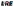
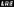
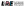
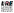
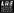

# LRE lab-logo

Please use one of the provided logos, preferrably in the vector format (SVG):

## Miscellaneous

- The font is DIN Next, same as the ETH logo. The font does not need to be installed for the logo to display correctly.
- The used colors are:
  - black `#000000`
  - white `#ffffff`
  - pink: `#ffa7c0`
  - ETH red: `#b7352d`
  - ETH petrol: `#007894`
  - ETH gray: `#6f6f6f`
- See [ETH color palette](https://ethz.ch/staffnet/en/service/communication/corporate-design/colours.html).
- See the [ETH logo guidelines](https://ethz.ch/staffnet/en/service/communication/corporate-design/logo.html).
- The logo uses media from [OpenMoji](https://openmoji.org/), licensed under `CC BY-SA 4.0`.

Created February 2024 by Vilém Zouhar and other members of the lab.